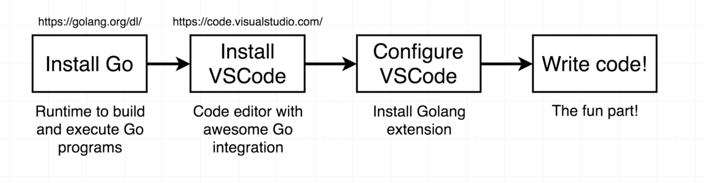
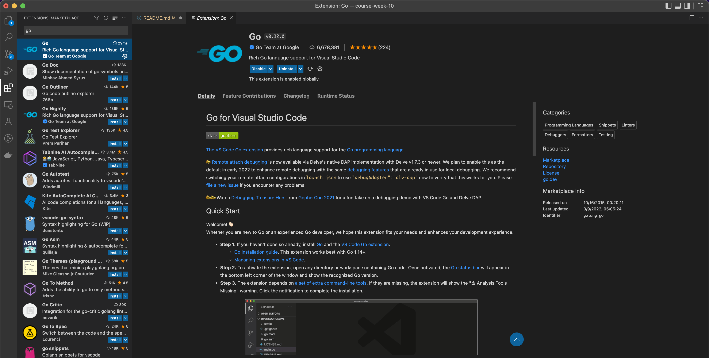
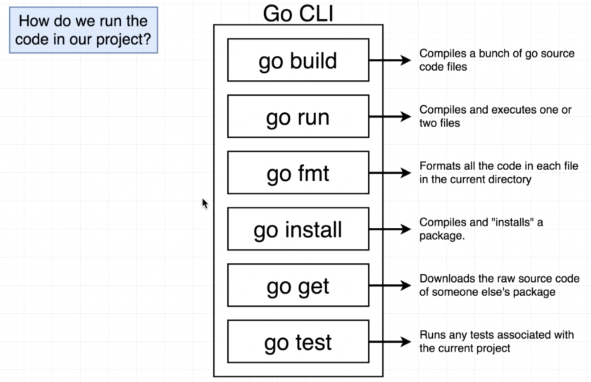

# Summary of Go: The Complete Developer's Guide (Golang)

## Getting Started


- Download Go in here: https://go.dev/dl
- Download VSCode in here: https://code.visualstudio.com
- Add plugin Go in VSCode


## Go CLI


## A Simple Start
- Hello World
```
package main
import "fmt"
func main() {
    fmt.Println("Helllo World")
}
```

## Variable Declarations
Inside a function, the := short assignment statement can be used in place of a var declaration with implicit type.

Outside a function, every statement begins with a keyword (var, func, and so on) and so the := construct is not
available.

```
package main
import "fmt"
func main() {
    var card string := "Ace of Spades"
    fmt.Println(card)
}
```
But there will be a little warning message, we don't have to use that method, there is another simpler alternative
```
package main
import "fmt"
func main() {
    card := "Ace of Spades"
    fmt.Println(card)
}
```
## Functions and Return Types
```
package main
import "fmt"
func main() {
    card := newCard()
    fmt.Println(card)
}

func newCard(){
    return "Five of Diamonds"
}
```
So that message is essentially telling us that we just wrote a function that is expecting to return
no data whatsoever, but we wrote in a return statement that returns a value of type string.

So we need to update our function declaration right here to inform the go compiler that whenever the new card function
is executed, it's going to return a value of type string to do so.

```
package main
import "fmt"
func main() {
    card := newCard()
    fmt.Println(card)
}

func newCard() string{
    return "Five of Diamonds"
}

```

## Slices and For Loops

Slice is an array element reference. Slices can be created, or they can be generated by manipulating an array or other slice. Because it is a reference data, making changes to the data in each slice element will have an impact on other slices that have the same memory address.

It's going to seem a little bit confusing because Goh has two basic data structures for handling lists of of records.
<table>
    <thead>
        <tr>
            <th>Array</th>
            <th>Slice</th>
        </tr>
    </thead>
    <tbody>
        <tr>
            <td>Fixed length list of things</td>
            <td>An array that can grow or shrink</td>
        </tr>
    </tbody>
</table>

### Array
An array is a collection of data of the same type, which is stored in a variable. Arrays have a capacity whose value is determined at the time of creation, so the number of elements/data stored in the array cannot exceed what has been allocated. The default value of each array element initially depends on its data type. If `int` then each element zero value is `0`, if `bool` then `false`, and so on. Each array element has an index in the form of a number that represents the position in the order of the elements. The array index starts at 0.

Example:
```
var names [4]string
names[0] = "trafalgar"
names[1] = "d"
names[2] = "water"
names[3] = "law"

fmt.Println(names[0], names[1], names[2], names[3])
```
Variable `names` are declared as a `array string` with an element allocation of 4 slots. How to fill the array element slot can be seen in the code above, by directly accessing the element using an index, then filling it.

### Slice
Slice creation is similar to array creation, except that you don't need to define the number of elements at the beginning of the declaration.

Example:
```
var fruits = []string{"apple", "grape", "banana", "melon"}
fmt.Println(fruits[0]) // "apple"
```

One of the differences between slices and arrays is that when the variable is declared, if the number of elements is not specified, then the variable is a slice.
```
var fruitsA = []string{"apple", "grape"}      // slice
var fruitsB = [2]string{"banana", "melon"}    // array
var fruitsC = [...]string{"papaya", "grape"}  // array
```

The `append() function` is used to add elements to the slice. The new element is positioned after the last index. The return value of this function is the slice to which the new value has been added.
```
var fruits = []string{"apple", "grape", "banana"}
var cFruits = append(fruits, "papaya")

fmt.Println(fruits)  // ["apple", "grape", "banana"]
fmt.Println(cFruits) // ["apple", "grape", "banana", "papaya"]
```

### For Loops
```
var fruits = []string{"apple", "grape", "banana"}
var cFruits = append(fruits, "papaya")

for i, fruit := range {
    fmt.Println(fruit)  // "apple" or "grape" or "banana"
}
```

## Struct in Go
Go does not have classes that exist in other strict OOP languages. But Go has a type of data structure called Struct.  A struct is a collection of variable (or property) and/or function (or method) definitions, wrapped as a new data type with a specific name. Properties in struct, the data type can vary.

### Defining Structs
```
type person struct {
    firstName string
    lastName string
}
```
### Declaring Structs
```
package main

type person struct {
    firstName string
    lastName string
}

func main(){
    alex := person{firstName: "Alex", lastName: "Anderson"}
    fmt.Println(alex) // {Alex Anderson}
}
```
## Map
Map is an associative data type in Go, in the form of a key-value pair. For each data (or value) that is stored, the key is also prepared. Key must be unique, because it is used as a marker (or identifier) ​​to access the value in question.

If you look at it, the map is similar to a slice, except that the index used for accessing can be determined by its own type (the index is a key).

Example:
```
package main

func main(){
    colors := map[string]string{
        "red": "#ff0000",
        "black": "#000000",
    }

    fmt.Println(colors) // map[red:#ff0000 black:#000000]
}
```